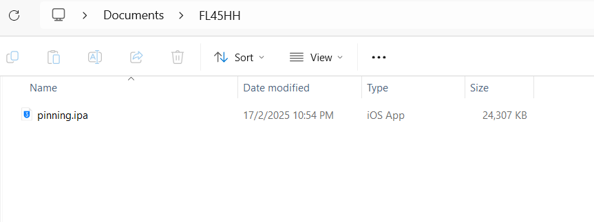
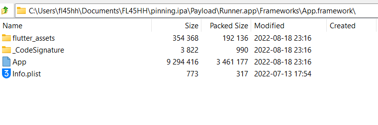
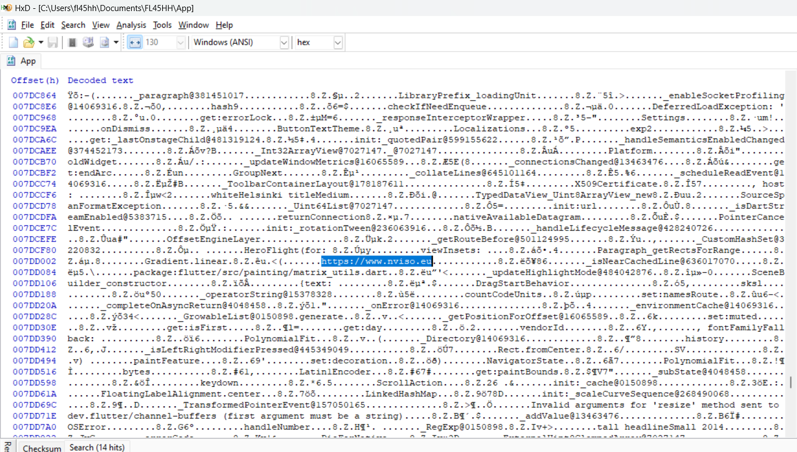
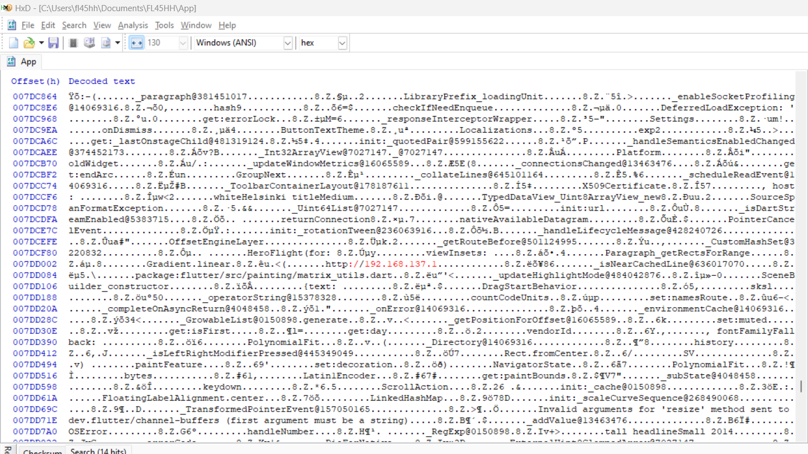
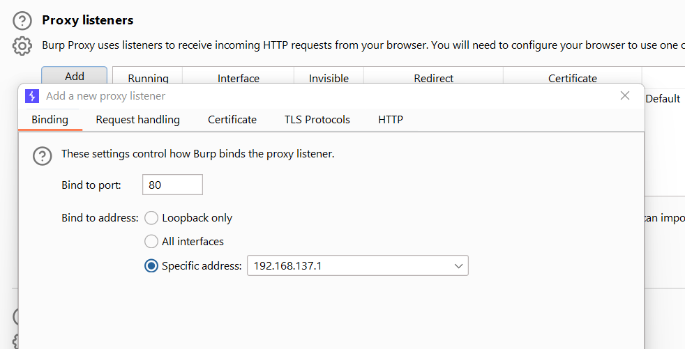
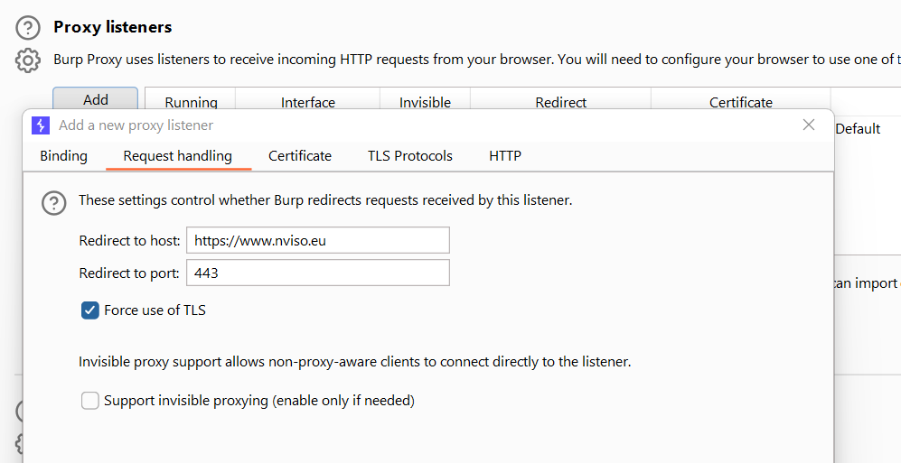
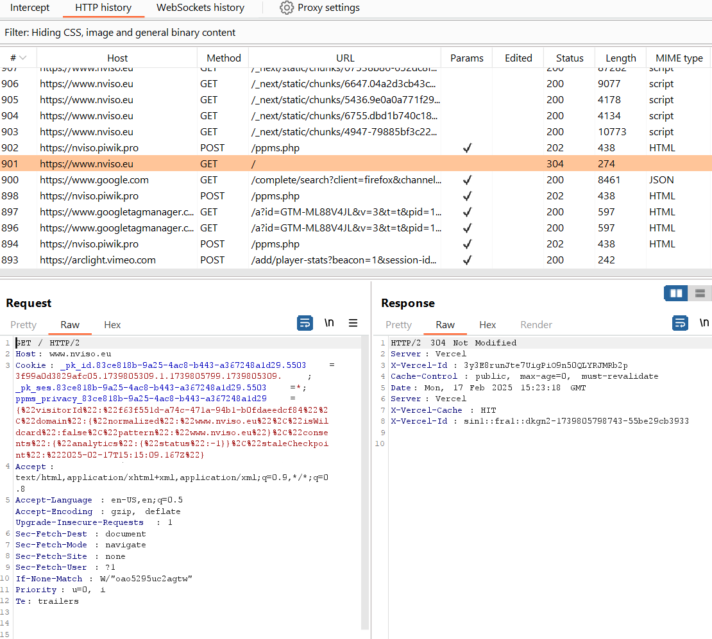

# iOS Flutter Penetration Testing via Network Routing

## Introduction

This document outlines a penetration testing technique for iOS Flutter applications. This method focuses on routing network traffic to a proxy tool like Burp Suite to intercept and analyze requests and responses. It's important to note that this technique is **distinct from SSL pinning bypass** and does not involve removing or circumventing SSL certificates. Instead, it leverages the ability to modify the application's network communication to use unencrypted HTTP, allowing for easier interception of traffic.

This approach can be valuable for bug bounty hunters and security researchers to understand the application's API interactions and identify potential vulnerabilities.

## Technique Overview

The core idea is to modify the Flutter iOS application binary to communicate over HTTP instead of HTTPS. By changing the hardcoded HTTPS URLs within the application to HTTP, we can then route this unencrypted traffic through Burp Suite for inspection. This is achieved by:

1.  **Obtaining the Target Application:**  Using a sample vulnerable application (`pinning.ipa`) provided for TLS verification testing.
2.  **Extracting Application Files:** Unpacking the IPA file to access the application's internal files, specifically targeting the Flutter application framework.
3.  **Modifying the Application Binary:** Using a hex editor to locate and replace instances of "https://" with "http://" within the application binary.
4.  **Setting up a Proxy Listener:** Configuring Burp Suite to listen for HTTP traffic on a specific IP address and port.
5.  **Configuring iOS Device Proxy:** Setting up the iOS device to use the Burp Suite listener as a manual proxy.
6.  **Routing Target Application Traffic:** Configuring Burp Suite to route traffic from the modified application to the intended backend server (while still using TLS if required by the backend).
7.  **Intercepting Traffic:** Launching the modified application and observing the intercepted HTTP requests in Burp Suite.

## Step-by-Step Guide

Follow these steps to implement the network routing technique for iOS Flutter penetration testing:

1.  **Download the Target Application (.ipa):**

    *   Obtain the `pinning.ipa` file from the provided source: [https://github.com/NVISOsecurity/disable-flutter-tls-verification/blob/main/test_app/pinning.ipa](https://github.com/NVISOsecurity/disable-flutter-tls-verification/blob/main/test_app/pinning.ipa)

     

     **Screenshot 1:** Show the downloaded `pinning.ipa` file, highlighting the source URL.

2.  **Extract the IPA File Contents:**

    *   Use a third-party tool (e.g., 7-Zip, The Unarchiver) to extract the contents of the `pinning.ipa` file.
    *   Navigate to the application binary file located at: `pinning.ipa\Payload\Runner.app\Frameworks\App.framework\App`. This `App` file is the primary target for modification.

     

     **Screenshot 2:** Display the extracted contents of `pinning.ipa`, clearly showing the path to `pinning.ipa\Payload\Runner.app\Frameworks\App.framework\App` and highlighting the `App` file.

3.  **Decompile and Search for HTTPS in Hex Editor:**

    *   Open the `App` file in a hex editor (e.g., HxD, Hex Fiend).
    *   Switch to a text view within the hex editor for easier readability.
    *   Search for the string `https://` to identify potential URLs used by the application.

     

     **Screenshot 3:** Show the hex editor with the `App` file open in text view, highlighting the search for `https://` and displaying instances of HTTPS URLs found in the binary.

4.  **Modify HTTPS to HTTP:**

    *   In the hex editor, replace the identified `https://` strings with `http://192.168.137.1`. Ensure the replacement string maintains the same length as the original to avoid corrupting the binary structure.  If necessary, pad with spaces or null bytes.
    *   **Note:**  `192.168.137.1` is used as an example IP address. This should be replaced with your computer's hotspot IP address.

     

     **Screenshot 4:** Display the hex editor showing the modified binary where `https://` has been replaced with `http://192.168.137.1`. Highlight the changes made.

5.  **Configure Burp Suite Proxy Listener:**

    *   Open Burp Suite Professional or Community Edition.
    *   Navigate to **Proxy** > **Options**.
    *   Add a new Proxy listener:
        *   **Bind to port:** `80`
        *   **Bind to address:**  Select your computer's hotspot IP address (e.g., `192.168.137.1`).
    *   Ensure the listener is enabled.

     

     **Screenshot 5:** Show the Burp Suite Proxy Options, highlighting the configured listener with port 80 and the hotspot IP address.

6.  **Configure iOS Device Proxy Settings:**

    *   On your iOS device, connect to your computer's Wi-Fi hotspot.
    *   Go to **Wi-Fi Settings** for your connected hotspot network.
    *   Configure **HTTP Proxy** to **Manual**.
        *   **Server:** Enter your computer's hotspot IP address (e.g., `192.168.137.1`).
        *   **Port:** `80`

7.  **Configure Burp Suite Request Routing:**

    *   In Burp Suite, navigate to **Proxy** > **Options** > **Request Handling**.
    *   Add a new rule under "Request Handling" if needed to specifically route traffic based on destination host or port.
    *   For this example, if you know the original target URL/IP and it uses port 443 (HTTPS), you can configure Burp Suite to forward traffic to that destination while still intercepting the initial HTTP request from the modified app.
    *   Enable "Force use of TLS" if the backend server expects TLS/HTTPS.

     

     **Screenshot 6:** Show the Burp Suite Request Handling settings, highlighting the rule for routing traffic to the target application's URL/IP and port 443 with "Force use of TLS" enabled.

8.  **Launch and Test the Modified Application:**

    *   Install the modified `pinning.ipa` onto your iOS device (you may need to resign the IPA file for installation).
    *   Launch the `pinning` application on your iOS device.
    *   Observe the HTTP requests being intercepted in Burp Suite's **Proxy** > **HTTP history** tab.

     

     **Screenshot 7:** Display Burp Suite's HTTP history, showing the intercepted HTTP requests from the modified `pinning` application. Highlight a sample intercepted request.

## Conclusion

This technique provides a method to intercept network traffic from iOS Flutter applications by routing it through Burp Suite via HTTP. It's a valuable approach for penetration testers to analyze application behavior and identify potential security vulnerabilities. Remember that modifying application binaries should be done in a controlled testing environment and with proper authorization.

## Acknowledgement

This technique was inspired by insights shared by my mentor, Pokley.

---
**Disclaimer:** This technique is intended for educational and ethical security testing purposes only. Modifying and testing applications should only be performed on applications you own or have explicit permission to test. Misuse of this technique for malicious purposes is strictly prohibited.
